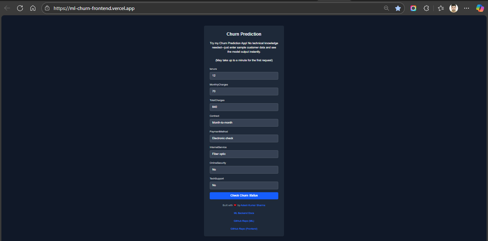
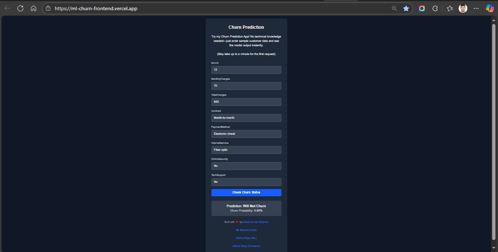

# Customer Churn ML Demo — Next.js Frontend

A modern, interactive frontend for the Dockerized FastAPI Customer Churn Prediction API. Easily input sample customer data, submit to the ML backend, and get instant churn status.

---

## Features

- Beautiful, user-friendly data input form for churn prediction.
- Sends sample data to FastAPI ML API and displays prediction (status & probability).
- SPA built with Next.js, React, and Tailwind CSS.
- No technical skills needed! No Postman or curl — just try, see results live.
- Deployable on Vercel (free) and easily connects to Docker or cloud FastAPI backend.

---

## Live Demo

Try it now: [https://ml-churn-frontend.vercel.app](https://ml-churn-frontend.vercel.app)

---

## Getting Started

### Prerequisites

- Node.js (>=18)
- Yarn or npm

### Installation

#### 1. Clone the repo

```bash
git clone https://github.com/yourusername/churn-ml-frontend.git
cd churn-ml-frontend
```

#### 2. Install dependencies

```bash
npm install
```

### Configuration

Edit `.env` (or use environment variables) to point to ML API backend:

```text
NEXT_PUBLIC_API_URL="http://localhost:8000"
```

or the cloud URL if deployed

```text
NEXT_PUBLIC_API_URL="https://ml-churn-prediction.onrender.com"
```

### Running Locally

```bash
npm run dev
```

Visit [http://localhost:3000](http://localhost:3000)

---

## Usage

1. Fill out all fields in the form (e.g. tenure, payment method, etc.).
2. Submit data — the app POSTs to the FastAPI `/predict` route.
3. Instantly view churn prediction & probability.

---

## Tech Stack

- **Frontend:** Next.js, React, Tailwind CSS
- **Backend:** FastAPI ML API (Python, Docker)
- **Deployment:** Vercel (frontend), Railway/Render (backend)

---

## Example API Request

```json
{
    "tenure": 12,
    "MonthlyCharges": 70,
    "TotalCharges": 840,
    "Contract": "Month-to-month",
    "PaymentMethod": "Electronic check",
    "InternetService": "Fiber optic",
    "OnlineSecurity": "No",
    "TechSupport": "No"
}
```

---

## Screenshots




---

## Project Structure

```table
.
├── pages/
│ └── index.js # App homepage with ML form
├── components/
│ └── PredictionForm.jsx # Form and UI logic
├── public/
│ └── demo-form.png
├── tailwind.config.js
├── .env
...
```

---

## Deployment

- **Frontend**: Vercel (automatic deploy via GitHub)
- **Backend**: Docker, Railway, or Render — publicly accessible URL required.

---

---

## Related Links

- FastAPI backend repo — [https://github.com/Adesh-Kumar-Sharma/ml-churn-prediction](https://github.com/Adesh-Kumar-Sharma/ml-churn-prediction)
- FastAPI backend docs website — [https://ml-churn-prediction.onrender.com/docs](https://ml-churn-prediction.onrender.com/docs)

---
